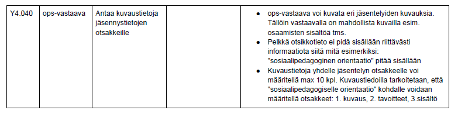

(johdanto)

Mikä projekti?
	Peppi - Koulutuksen suunnittelijan ja opettajan palvelut
	Toiminnallinen vaatimusmäärittely
	
Lukijakunta, kenelle dokumentti on tarkoitettu?
	Järjestelmän toteuttajille ja tilaajille.
	
Tilanne?
Kehitteillä.

Motivaatio, miksi dokumentti on luotu?
Jotta voidaan määritellä Peppi-tietojärjestelmäkokonaisuuden ominaisuudet ja
toiminnot.

Dokumentin rakenne, millainen se on esim. verrattuna projektissa käytettävään malliin? Kts. myös Wikipediasta löytyvä runko.
Wikipedian mallia suurinpiirtein noudattava, kattava.

(käyttötapaukset)

Mitä sillä voi tehdä?
Kaikenlaista opetuksen suunnitteluun liittyvää.

Käyttäjiä on ainakin kahta tyyppiä, suunnittelija ja opettaja. Näillä on osittain samoja toimintoja käytettävissä.

Suunnittelija:

	- Sähköinen työpöytä, josta hallitaan eri toimintoja
	- Pikaviestipalvelut
	- Oma profiili
	- Opetussuunnitelun työkalut
	- Työ- ja lukujärjestyssuunnittelu
	- Raportointi, tieto ja seuranta
	
Opettaja:

	- Pikaviestit
	- Oma profiili
	- Työaikasuunnitelmien hallinta
	- Toteutusten hallintatyökalu
	- Oman työjärjestyksen hallintaväline ja opetustapahtumien ylläpito ja hallinta
	- Opintojaksototeutusten ilmoittautumisten hallinta
	- Väliarviointi, arviointi ja arvosanojen hallinta
	- Opintojaksopalautteen hallinta
	- Opiskelijakansio
	- Sähköisten työtilojen ja oppimisympäristöjen hallinta
	- Oppimateriaalien hallinta ja toteutussuunnitelmatietojen kopiointi
	- Opetussuunnittelu
	
Käyttötapauskaavio(t)?

Eri käyttötapauksia on kuvattu kymmeniä ja niiden toiminnot on kuvattu hyvinkin tarkasti lukuisine huomioineen.

Käyttötapaukset ovat tarinamuodossa taulukossa.

esim.

(järjestelmän yleisrakenne)

    MITÄ KAAVIOTEKNIIKOITA KÄYTETÄÄN? MIKSI?

(funktionaaliset & ei-funktionaaliset vaatimukset)

    esitetäänkö listauksena?
    tunnistetiedot? numeroitu?
    jäljitettävyys? mitattavuus? (Miten voidaan jälkikäteen todentaa, että vaatimukset on myös toteutettu, kuten suunniteltu?)

(miltä se näyttää)

    onko käyttöliittymästä kuvia?
    luonnoksia vai kuvakaappauksia valmiista käyttöliittymästä?
    miten eri näkymien (views) välillä liikutaan?

(prosessimalli)

    onko kuvattu? voi olla myös erillisessä projektisuunnitelmadokumentissa
    resurssit? budjetti?
    riskianalyysi?

(johtopäätökset, oma mielipide)

    mikä tekee hyvän dokumentin?
    onko tämä sellainen? miksi?
    kaavioiden käyttö: laatu? määrä? hyöty?
