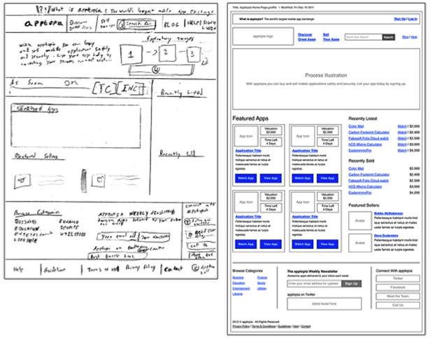

## Harjoitus 5: Käyttöliittymän suunnittelu

#### 1. Selitä seuraavat käsitteet:

  1. Näkymä (view)
  
  Screenshot, ruutukaappaus siitä miltä ohjelma näyttää missäkin tilassa.
  
  2. Wireframe
  
  Wireframes are super-low fidelity (which means simple: lines, boxes, text) designs that focus on content hierarchy, general layout and functionality. It's a purely structural document that tries to organise content and interaction without all the visual clutter that design elements can create.
  
   When drafting a wireframe, you should be asking yourself four questions:
		What content needs to be on the page?
    How do the different pieces of content relate to one another?
    How might they possibly be arranged?
    How should the user interact with the content?
  
  
  
  http://www.creativebloq.com/design/create-wireframes-work-you-8126137
  
  3. Mockup
  
  Näköismalli siitä, mitä ohjelmalla voisi tehdä ja miltä se näyttäisi.
  
  4. Prototyyppi
  
  Ohjelma, jolla voi tehdä jotain mitä lopullisellakin ohjelmalla.
  
  
  
#### 2. Käyttöliittymän näkymät (User interface, views), oma projektiaihe. Voi tehdä pienryhmissä. 

1. Miten käyttötapaukset ja käyttöliittymät voisi yhdistää toisiinsa vaatimusmäärittelydokumentaatiossa? Perustele
vastauksesi.
2. Listaa järjestelmän käyttöliittymän olennaisimmat näkymät
3. Kuvaile näkymät *sanallisesti*: mitä näkymällä tehdään ja mitä siinä näkyy. Pyri määrittelemään tässä näkymät
*toiminnallisesta näkökulmasta*, älä niinkään ajattele miltä ne näyttävät
4. Määritä näkymien väliset siirtymät korkealla tasolla, mistä näkymästä pääsee minnekin? Millä tavoin visualisoisit tilasiirtymät?
5. Listaa jokaista näkymää kohti tieto siitä, millaista tietosisältöä tai data käyttöliittymässä näytetään.

#### 3. Visualisoi listaamasi näkymät ja niihin liittyvät siirtymät

- vähintään 3 näkymää
- Voit käyttää Painttia, Visiota tai esimerkiksi [Moqupsia](https://moqups.com/). 

**Palauta linkki projektinne tiedostoon (Github), mistä löytyvät vastaukset tehtäviin. Vaikka teitte työn ryhmätyönä, jokainen palauttaa linkin Tuubiin henkilökohtaisesti.**